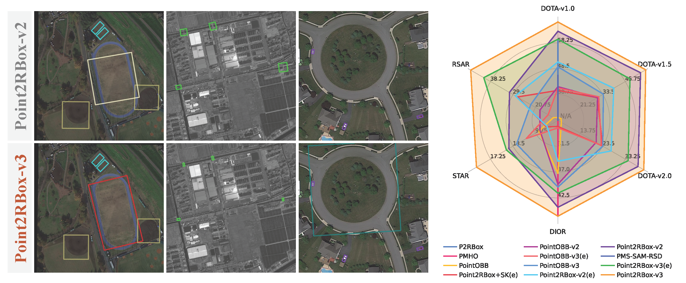
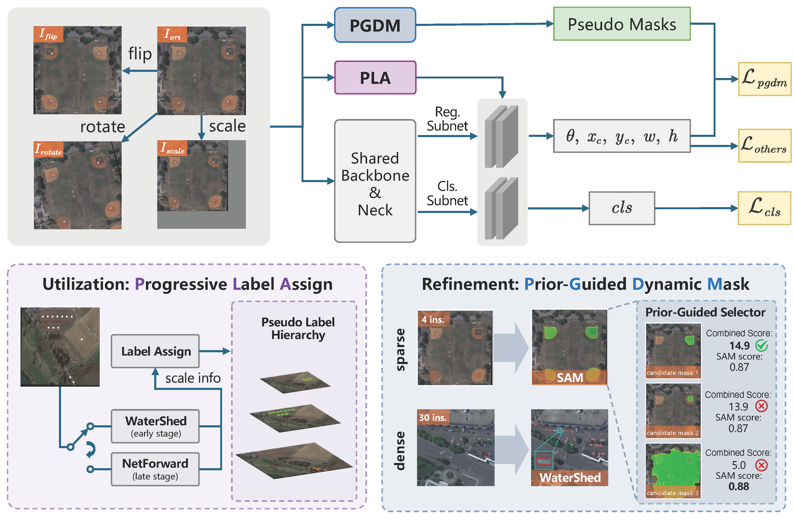
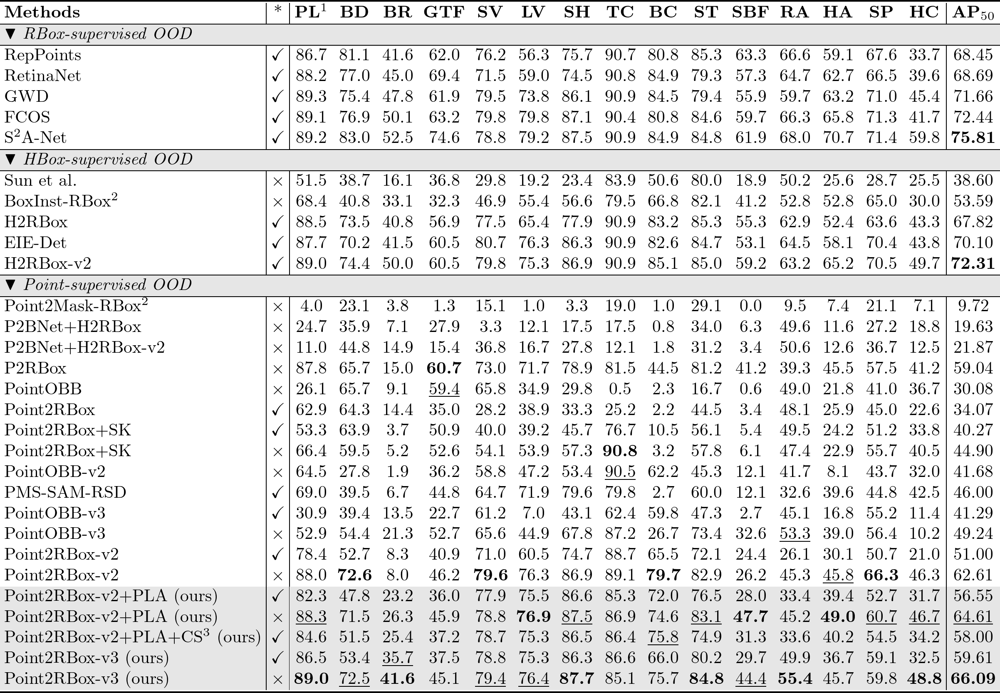
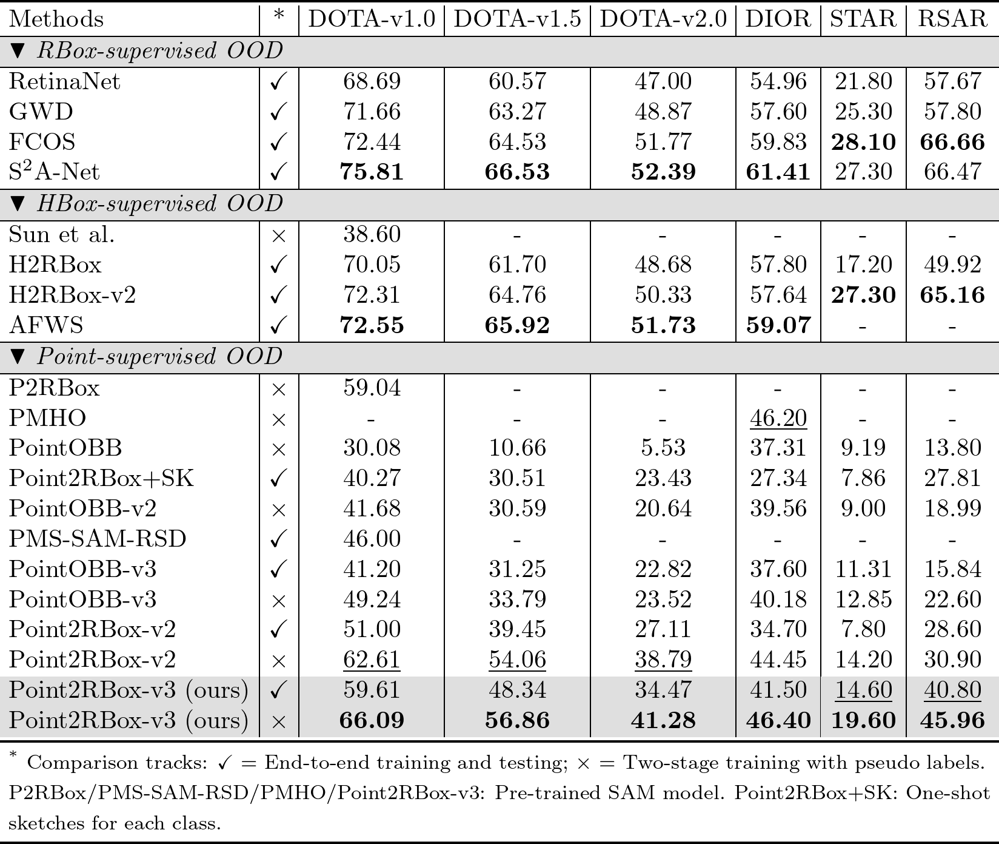
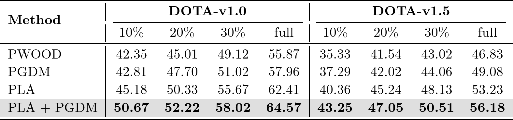

<h1>Point2RBox-v3: Self-Bootstrapping from Point Annotations via Integrated Pseudo-Label Refinement and Utilization</h1>

  
  
  
  

## TODOs

- [x] Release the paper on arXiv.
- [x] Release the complete code.
- [x] Release the checkpoints.
- [ ] Release training configurations and model checkpoints on 5 additional datasets. 

!!! We have open-sourced the code and model checkpoints. Note that the performance reproduced with the refactored code is fully aligned with, and in some cases shows a slight improvement over, the results reported in the paper.

## Reproduction

|methods|e2e|mAp|config_file|log|email|model|
|---|---|---|---|---|---|---|
|PLA|Y|56.43|[point2rbox_v3-1x-dotav1-0](https://pan.quark.cn/s/dd47829984b7)|[20251022_160639](https://pan.quark.cn/s/fb03a9c4a3de)|[dota_evaluation_results_feedback_of_task1](https://pan.quark.cn/s/f20b5b25edbf)|[epoch_12.pth](https://pan.quark.cn/s/1ea5b81afc51)|
|Point2RBox-v3|Y|61.38|[point2rbox_v3-1x-dotav1-0](https://pan.quark.cn/s/920e021ba5f3)|[20251022_160639](https://pan.quark.cn/s/78de152d8111)|[dota_evaluation_results_feedback_of_task1](https://pan.quark.cn/s/0408d5c50e5d)|[epoch_12.pth](https://pan.quark.cn/s/dc4b7c2a4233)|
|Point2RBox-v3|N|67.24|[rotated-fcos-1x-dotav1-0-using-pseudo](https://pan.quark.cn/s/ec1439c5de12)|[20251028_191527](https://pan.quark.cn/s/815de5c87ce1)|[dota_evaluation_results_feedback_of_task1](https://pan.quark.cn/s/4be7e15ebda0)|[epoch_12.pth](https://pan.quark.cn/s/ca0eb358ce08)|

|method|dataset|e2e|mAp|config_file|log|text info|model|
|---|---|---|---|---|---|---|---|
|Point2RBox-v3|STAR|Y|16.20|[point2rbox_v3-1x-star](https://pan.quark.cn/s/5a7d85924fdf)|[20251031_181448](https://pan.quark.cn/s/cfae7ddf7040)|[results-tab-409093](https://www.codabench.org/competitions/3475/?secret_key=f1aff9f3-696d-4e10-9a63-f113153ed686#/results-tab)|[epoch_12.pth](https://pan.quark.cn/s/e89220e97d2e)|
|Point2RBox-v3|STAR|N|19.60|[rotated-fcos-1x-star-using-pseudo](https://pan.quark.cn/s/635ba2bc670e)|[20251102_001001](https://pan.quark.cn/s/fed4ff52166a)|[results-tab-350178](https://www.codabench.org/competitions/3475/?secret_key=f1aff9f3-696d-4e10-9a63-f113153ed686#/results-tab)|[epoch_12.pth](https://pan.quark.cn/s/6913784b40d5)|
|Point2RBox-v3|DIOR|Y|41.70|[point2rbox_v3-1x-dior](https://pan.quark.cn/s/8b474708c12b)|[20251031_202113](https://pan.quark.cn/s/b1e5647902ab)|x|[epoch_12.pth](https://pan.quark.cn/s/af2e1a97e0e2)|
|Point2RBox-v3|DIOR|N|46.60|[rotated-fcos-1x-dior-using-pseudo](https://pan.quark.cn/s/f1faabf451f7)|[20251101_135239](https://pan.quark.cn/s/c4eae5602aa2)|x|[epoch_12.pth](https://pan.quark.cn/s/056d82cbdadf)|
|Point2RBox-v3|DOTAV1-5|Y|49.08|[point2rbox_v3-1x-dotav1-5](https://pan.quark.cn/s/b63e63760eba)|[20251108_172545](https://pan.quark.cn/s/d61c8d032560)|[DOTA-v1.5_Evaluation_Results_Feedback_of_Task1](https://pan.quark.cn/s/438eb1014f2b)|[epoch_12.pth](https://pan.quark.cn/s/03cffd557793)|

## Overview
* **Visual Comparison & Radar Evaluation.**

  

* **An Overview of Point2RBox-v3 and Pipeline.**

  

* **The process of Progressive Label Assignment (PLA).**

  

* **Comparison between watershed and SAM masks on DOTA-v1.0.**

  

## Main Results

* **Detection performance of all categories and the mean AP50 on the DOTA-v1.0**

  

* **AP$_{50}$ comparisons on the DOTA-v1.0/1.5/2.0, DIOR, STAR, and RSAR datasets.**

    

* **AP$_{50}$ comparison on DOTA-v1.0/v1.5 under the partial weakly-supervised setting.**

  

## Contact

If you have any questions about this paper or code, feel free to email me at [zhangteng@sjtu.edu.cn](mailto:zhangteng@sjtu.edu.cn). This ensures I can promptly notice and respond!
