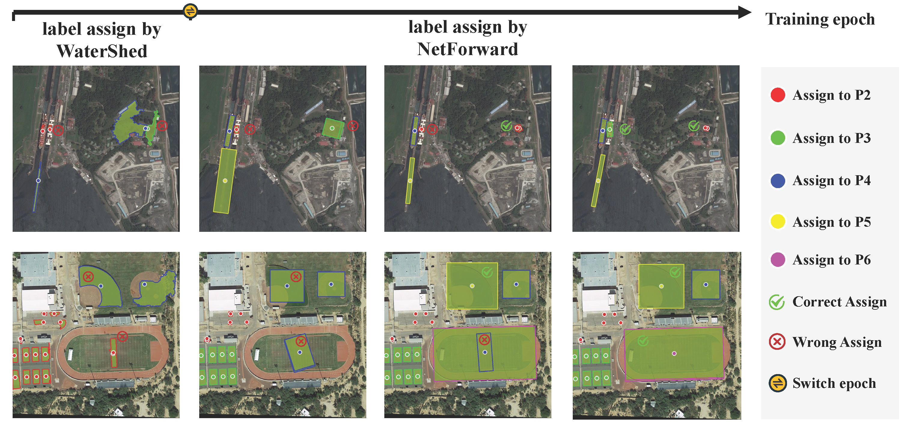

<h1>Point2RBox-v3: Self-Bootstrapping from Point Annotations via Integrated Pseudo-Label Refinement and Utilization</h1>

   

## Abstract

Driven by the growing need for Oriented Object Detection (OOD), learning from point annotations under a weakly-supervised framework has emerged as a promising alternative to costly and laborious manual labeling. In this paper, we discuss two deficiencies in existing point-supervised methods: inefficient utilization and poor quality of pseudo labels. Therefore, we present Point2RBox-v3. At the core are two principles: \textbf{1) Progressive Label Assignment (PLA)}. It dynamically estimates instance sizes in a coarse yet intelligent manner at different stages of the training process, enabling the use of label assignment methods. \textbf{2) Prior-Guided Dynamic Mask Loss (PGDM-Loss)}. It is an enhancement of the Voronoi Watershed Loss from Point2RBox-v2, which overcomes the shortcomings of Watershed in its poor performance in sparse scenes and SAM's poor performance in dense scenes. To our knowledge, Point2RBox-v3 is the first model to employ dynamic pseudo labels for label assignment, and it creatively complements the advantages of SAM model with the watershed algorithm, which achieves excellent performance in both sparse and dense scenes. Our solution gives competitive performance, especially in scenarios with large variations in object size or sparse object occurrences: 66.09\%/56.86\%/41.28\%/46.40\%/19.60\%/45.96\% on DOTA-v1.0/DOTA-v1.5/DOTA-v2.0/DIOR/STAR/RSAR.

## TODOs

- [x] Release the paper on arXiv.
- [x] Release the complete code.
- [x] Release the checkpoints.
- [ ] Release training configurations and model checkpoints on 5 additional datasets. 

!!! We have open-sourced the code and model checkpoints. Note that the performance reproduced with the refactored code is fully aligned with, and in some cases shows a slight improvement over, the results reported in the paper.

## Results and models

|methods|e2e|mAp|config_file|log|email|model|
|---|---|---|---|---|---|---|
|PLA|Y|56.43|[point2rbox_v3-1x-dotav1-0](https://pan.quark.cn/s/dd47829984b7)|[20251022_160639](https://pan.quark.cn/s/fb03a9c4a3de)|[dota_evaluation_results_feedback_of_task1](https://pan.quark.cn/s/f20b5b25edbf)|[epoch_12.pth](https://pan.quark.cn/s/1ea5b81afc51)|
|Point2RBox-v3|Y|61.38|[point2rbox_v3-1x-dotav1-0](https://pan.quark.cn/s/920e021ba5f3)|[20251022_160639](https://pan.quark.cn/s/78de152d8111)|[dota_evaluation_results_feedback_of_task1](https://pan.quark.cn/s/0408d5c50e5d)|[epoch_12.pth](https://pan.quark.cn/s/dc4b7c2a4233)|
|Point2RBox-v3|N|67.24|[rotated-fcos-1x-dotav1-0-using-pseudo](https://pan.quark.cn/s/ec1439c5de12)|[20251028_191527](https://pan.quark.cn/s/815de5c87ce1)|[dota_evaluation_results_feedback_of_task1](https://pan.quark.cn/s/4be7e15ebda0)|[epoch_12.pth](https://pan.quark.cn/s/ca0eb358ce08)|

## Overview
* **Visual Comparison & Radar Evaluation.**

  

* **An Overview of Point2RBox-v3 and Pipeline.**

  

* **The process of Progressive Label Assignment (PLA).**

  

* **Comparison between watershed and SAM masks on DOTA-v1.0.**

  

## Main Results

* **Detection performance of all categories and the mean AP50 on the DOTA-v1.0**

  

* **AP$_{50}$ comparisons on the DOTA-v1.0/1.5/2.0, DIOR, STAR, and RSAR datasets.**

    

* **AP$_{50}$ comparison on DOTA-v1.0/v1.5 under the partial weakly-supervised setting.**

  

## Contact

If you have any questions about this paper or code, feel free to email me at [zhangteng@sjtu.edu.cn](mailto:zhangteng@sjtu.edu.cn). This ensures I can promptly notice and respond!
